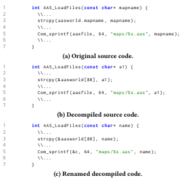

Meaningful Variable Names for Decompiled Code [3]:
--------------------------------------------------
The authors of this paper take advantage of how natural code (code written by
people) is highly reptitive and predicatable based on the context. They
consider the output of the decompiler to be a noisy distortion of the
original source. They use "standard statistical machine translation
approaches to choose natural identifiers, combining a translation model
trained on a parallel corpus with a language model trained on unmodified C
code." They generate the corpus with 1.2 TB of C source code from GitHub.
They estimate that their thing work 16.2% of the time. Their largest issue
is that decompilers output code that humans would never write, independent
of variable naming. An example of there work is in the below image.

Bibliography
------------
[1] A. Jaffe, J. Lacomis, E. J. Schwartz, C. L. Goues, and B. Vasilescu,
“Meaningful variable names for decompiled code,” Proceedings of the 26th
Conference on Program Comprehension -ICPC 18, 2018.